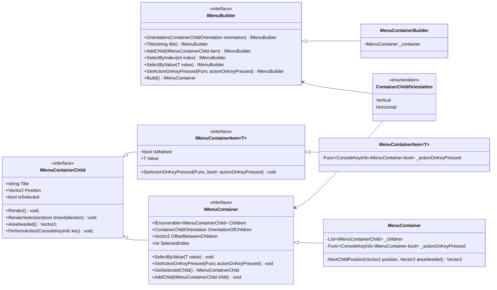

# Console Extension

## Class diagram overview

```mermaid
classDiagram
direction RL
class IMenuBuilder{
    <<interface>>
    +Orientation(ContainerChildOrientation orientation) IMenuBuilder
    +Title(string title) IMenuBuilder
    +AddChild(IMenuContainerChild item) IMenuBuilder
    +SelectByIndex(int index) IMenuBuilder
    +SelectByValue<T>(T value) IMenuBuilder
    +SetActionOnKeyPressed(Func<ConsoleKeyInfo, IMenuContainer, bool> actionOnKeyPressed) IMenuBuilder
    +Build() IMenuContainer
}

class IMenuContainer{
    <<interface>>
    +IEnumerable~IMenuContainerChild~ Children
    +ContainerChildOrientation OrientationOfChildren
    +Vector2 OffsetBetweenChildren
    +int SelectedIndex

    +SelectByValue<T>(T value) void
    +SetActionOnKeyPressed(Func<ConsoleKeyInfo, IMenuContainer, bool> actionOnKeyPressed) void
    +GetSelectedChild() IMenuContainerChild
    +AddChild(IMenuContainerChild child) void
}

class IMenuContainerChild{
    <<interface>>
    +string Title
    +Vector2 Position
    +bool IsSelected
    +Render() void;
    +RenderSelection(bool showSelection) void;
    +AreaNeeded() Vector2;
    +PerformAction(ConsoleKeyInfo key) void;
}


class IMenuContainerItem~T~{
    <<interface>>
    +bool IsMarked
    +T Value
    +SetActionOnKeyPressed(Func<ConsoleKeyInfo, IMenuContainerItem<T>, bool> actionOnKeyPressed) void
}

class ContainerChildOrientation{
    <<enumeration>>
    Vertical
    Horizontal
}

class MenuContainer{
    -List~IMenuContainerChild~ _children
    -Func~ConsoleKeyInfo-IMenuContainer-bool~ _actionOnKeyPressed
    -NextChildPosition(Vector2 position, Vector2 areaNeeded) Vector2
}

class MenuContainerItem~T~{
    -Func~ConsoleKeyInfo-IMenuContainer-bool~ _actionOnKeyPressed
}

%%class PerformAction{
%%    MoveSelectionUpOrDown(ConsoleKeyInfo key, IMenuContainer container) bool$
%%    MoveSelectionLeftOrRight(ConsoleKeyInfo key, IMenuContainer container) bool$
%%}

class MenuContainerBuilder{
    -IMenuContainer _container
}

IMenuContainerItem --|> IMenuContainerChild
IMenuContainer --|> IMenuContainerChild
MenuContainerBuilder --|> IMenuBuilder
ContainerChildOrientation --> IMenuBuilder
ContainerChildOrientation --> IMenuContainer
MenuContainer --|> IMenuContainer
MenuContainerItem --|> IMenuContainerItem
```